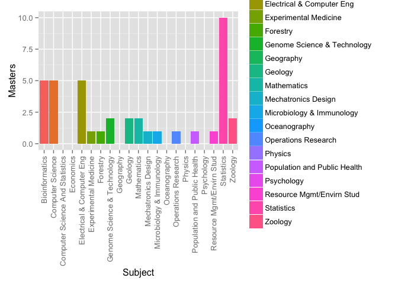

# R_markdown_note


## R Markdown Practice


Here is an enrollment summary table for STAT545:


```r
library(ggplot2)
summary(enrollment)
```

```
##                             Subject        BSC             Masters      
##  Bioinformatics                 : 1   Min.   :0.00000   Min.   : 0.000  
##  Computer Science               : 1   1st Qu.:0.00000   1st Qu.: 0.000  
##  Computer Science And Statistics: 1   Median :0.00000   Median : 1.000  
##  Economics                      : 1   Mean   :0.09524   Mean   : 1.905  
##  Electrical & Computer Eng      : 1   3rd Qu.:0.00000   3rd Qu.: 2.000  
##  Experimental Medicine          : 1   Max.   :1.00000   Max.   :10.000  
##  (Other)                        :15                                     
##       PHD             Total       
##  Min.   :0.0000   Min.   : 1.000  
##  1st Qu.:0.0000   1st Qu.: 1.000  
##  Median :0.0000   Median : 2.000  
##  Mean   :0.8571   Mean   : 2.857  
##  3rd Qu.:1.0000   3rd Qu.: 5.000  
##  Max.   :5.0000   Max.   :11.000  
## 
```

## Including Plots

You can also embed plots, for example:


```r
p <- ggplot(enrollment, aes(x =Subject, y = Masters, fill = Subject))

p + geom_bar(stat="identity") + theme(axis.text.x=element_text(angle=90,hjust=1,vjust=0.5))
```

 

Note that the `echo = FALSE` parameter was added to the code chunk to prevent printing of the R code that generated the plot.
